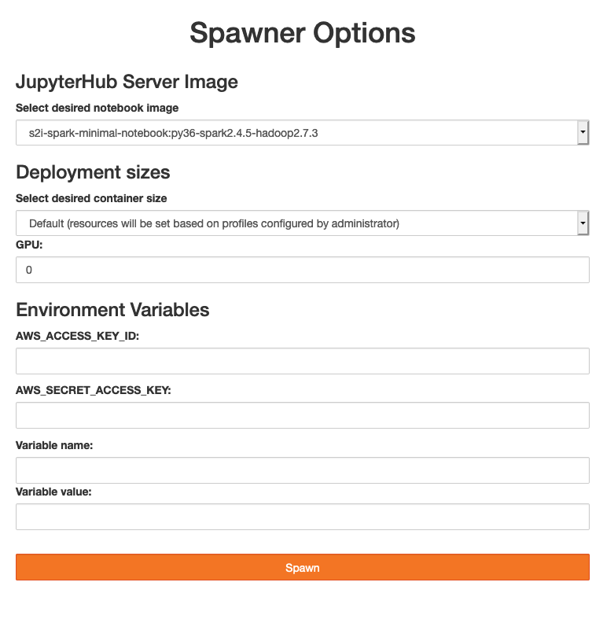
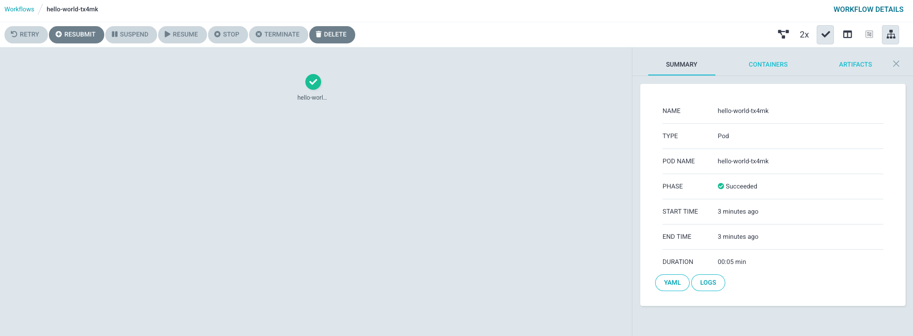
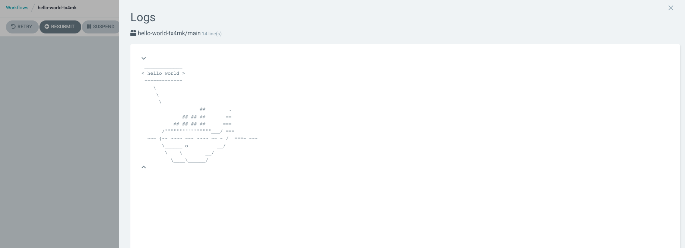
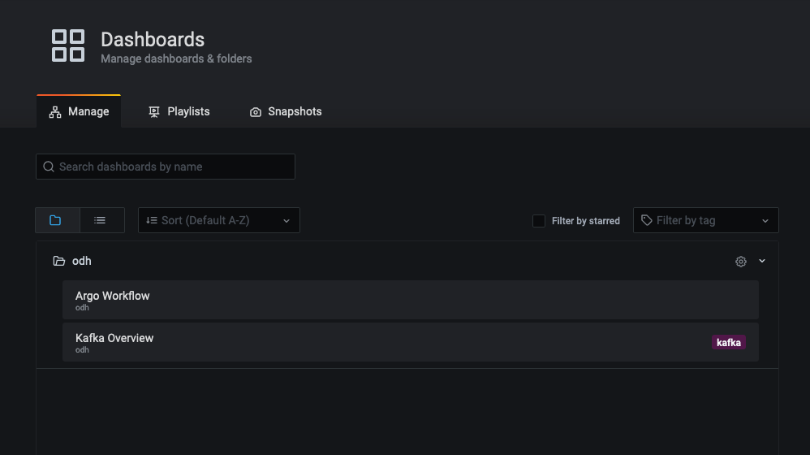

# Installing Open Data Hub on Azure Red Hat OpenShift

The purpose of this repo is to provide sample instructions for installing Open Data Hub (ODH) in Azure Red Hat OpenShift (ARO).  We'll do a smoke test of the components to ensure Open Data Hub components operate as expected.

## Prerequisites

* Azure Red Hat OpenShift 4 cluster
* Admin access to OpenShift
* [OpenShift CLI](https://docs.openshift.com/container-platform/4.6/cli_reference/openshift_cli/getting-started-cli.html)

## Prep

Login to the cluster using `oc login` and admin credentials.

Create a new project for ODH

```bash
oc new-project odh
```

## Open Data Hub

We will deploy ODH using the Operator.

Login to the cluster using the console and admin credentials.

Navigate to OperatorHub and search for `Open Data Hub Operator`.  Install using the `beta` channel.  The version installed in this guide is `0.9`.


Under the install operators, you should see the status of the operator change to `Succeeded`.  

You can also run

```
oc wait --for=condition=Available deploy/opendatahub-operator -n openshift-operators
```

Make sure you are in the `odh` project.  Once the operator is running, click on `Open Data Hub` under the Provided APIs.


Select `Create KfDef`


Switch to the YAML view if you would like to see the underlying components.  We'll stick with the defaults and install.  Click `Create`.


Wait until all the components are deployed and running

```
oc get pods -n odh
```

> Output

```
NAME                                                          READY   STATUS      RESTARTS   AGE
airflow-on-k8s-operator-controller-manager-557945bd5c-mkqz8   1/1     Running     0          4h48m
argo-server-6dfb7f65f9-jbkbh                                  1/1     Running     0          4h48m
grafana-deployment-db6c8989c-hrsxz                            1/1     Running     0          4h47m
grafana-operator-69f449bf54-n7fq9                             1/1     Running     0          4h47m
jupyterhub-1-deploy                                           0/1     Completed   0          4h48m
jupyterhub-1-tcwvj                                            1/1     Running     0          4h47m
jupyterhub-db-1-deploy                                        0/1     Completed   0          4h48m
jupyterhub-db-1-wtmr9                                         1/1     Running     0          4h47m
jupyterhub-nb-kube-3aadmin                                    2/2     Running     0          4h28m
odh-dashboard-645579c66d-92jdg                                1/1     Running     0          4h47m
odh-dashboard-645579c66d-hd6tg                                1/1     Running     0          4h47m
odh-message-bus-entity-operator-6bfb9b9749-9mgxj              3/3     Running     0          5h20m
odh-message-bus-kafka-0                                       2/2     Running     0          5h21m
odh-message-bus-kafka-1                                       2/2     Running     0          5h21m
odh-message-bus-kafka-2                                       2/2     Running     0          5h21m
odh-message-bus-zookeeper-0                                   1/1     Running     0          5h22m
odh-message-bus-zookeeper-1                                   1/1     Running     0          5h22m
odh-message-bus-zookeeper-2                                   1/1     Running     0          5h22m
prometheus-operator-7dbf9b587c-t7kdl                          1/1     Running     0          4h47m
prometheus-prometheus-0                                       3/3     Running     1          4h47m
seldon-controller-manager-7d9b7d5b87-h62ds                    1/1     Running     0          4h48m
spark-operator-746dd44db5-pxk76                               1/1     Running     0          4h47m
superset-1-bg792                                              1/1     Running     0          5h22m
superset-1-deploy                                             0/1     Completed   0          5h22m
workflow-controller-fc6b4dcff-mjhhs                           1/1     Running     0          4h48m
```

You can also view the ODH components you installed in the ODH dashboard.  Grab the public route and open it in your browser.

```
echo $(oc get route odh-dashboard -n odh --template='http://{{.spec.host}}')
```

You should see:


## Smoke Test

Let's smoke test each component.

### JupyterHub

Launch JupyterHub from the ODH Dashboard.  Alternatively, you can grab the public route and open it in your browser.

```
echo $(oc get route jupyterhub -n odh --template='http://{{.spec.host}}')
```

Select the `s2i-spark-minimal-notebook` image and spawn the server.  Leave the other settings as they are.



Wait a few minutes for the server to start.

> Try refreshing the browser if you don't see any progress after a couple minutes.

Start a Python 3 notebook:


### Spark

In the JupyterHub notebook, let's run a simple Spark application. 

Copy this code and execute

```python
from pyspark.sql import SparkSession, SQLContext
import os

# create a spark session
spark_cluster_url = f"spark://{os.environ['SPARK_CLUSTER']}:7077"
spark = SparkSession.builder.master(spark_cluster_url).getOrCreate()

# run a sample computation on the spark cluster
data = [1, 2, 3, 4, 5]
distData = spark.sparkContext.parallelize(data)
distData.reduce(lambda a, b: a + b)
```

> Output

```
15
```

### Seldon

Let's test Seldon Core with a pre-packaged model.

Deploy a pre-packaged model

```bash
oc apply -f - << END
apiVersion: machinelearning.seldon.io/v1
kind: SeldonDeployment
metadata:
  name: iris-model
spec:
  name: iris
  predictors:
  - graph:
      implementation: SKLEARN_SERVER
      modelUri: gs://seldon-models/sklearn/iris
      name: classifier
    name: default
    replicas: 1
END
```

Wait until the model is ready

```bash
oc wait --for=condition=Available deploy/iris-model-default-0-classifier
```

Expose the model with a public route

```bash
oc expose svc iris-model-default
```

Send a sample request

```bash
MODEL_URL=$(oc get route iris-model-default --template='http://{{.spec.host}}')
curl -X POST $MODEL_URL/api/v1.0/predictions \
    -H 'Content-Type: application/json' \
    -d '{ "data": { "ndarray": [[1,2,3,4]] } }'
```

> Output (sample)

```
{
    "data": {
        "names": [
            "t:0",
            "t:1",
            "t:2"
        ],
        "ndarray": [
            [
                0.0006985194531162841,
                0.003668039039435755,
                0.9956334415074478
            ]
        ]
    },
    "meta": {}
}
```

### Argo

Test Argo with a sample workflow.

Create a workflow role

```bash
oc create -f - << END
apiVersion: rbac.authorization.k8s.io/v1
kind: ClusterRole
metadata:
  name: workflow-role
rules:
# pod get/watch is used to identify the container IDs of the current pod
# pod patch is used to annotate the step's outputs back to controller (e.g. artifact location)
- apiGroups:
  - ""
  resources:
  - pods
  verbs:
  - get
  - watch
  - patch
# logs get/watch are used to get the pods logs for script outputs, and for log archival
- apiGroups:
  - ""
  resources:
  - pods/log
  verbs:
  - get
  - watch
END
```

Bind the role to the default service account

```bash
oc adm policy add-role-to-user workflow-role -z default -n odh
```

Create the workflow

```bash
oc create -f https://raw.githubusercontent.com/argoproj/argo/master/examples/hello-world.yaml
```

Look at the workflow

```
oc get workflow
```

> Output (sample)

```
NAME                STATUS      AGE
hello-world-tx4mk   Succeeded   34s
```

You can also navigate to the Argo UI.

```bash
echo $(oc get route argo-portal -n odh --template='http://{{.spec.host}}')
```

Click on the hello world workflow and the green checkmark.  You will see:



You can also view the logs to see the hello world whale:




### Superset

[Follow these steps](https://gitlab.com/opendatahub/opendatahub-operator/-/blob/master/docs/deploying-superset.adoc) to test Superset with PostgreSQL.


### Prometheus

Let's add alert rules for our Kafka cluster.

```bash
oc create -f https://raw.githubusercontent.com/strimzi/strimzi-kafka-operator/master/examples/metrics/prometheus-install/prometheus-rules.yaml
```

Launch Prometheus from the ODH Dashboard.  Alternatively, you can grab the public route and open it in your browser.

```
echo $(oc get route prometheus-portal -n odh --template='http://{{.spec.host}}')
```

Navigate to `Alerts` at the top.  You should see your new alert rules.


### Grafana

Launch Grafana from the ODH Dashboard.  Alternatively, you can grab the public route and open it in your browser.

```
echo $(oc get route grafana-route -n odh --template='https://{{.spec.host}}')
```

Click the square icon on the left to see `Dashboards` and select `Manage`.

Open the `odh` folder and you should see two dashboards:



Open `Kafka Overview` and you should see information about your Kafka cluster.

### Kafka


### Airflow


## Troubleshooting

1.  If you delete the ODH operator and need to reinstall again, you have to manually delete the old operator group.  Otherwise the next install will move into a stuck `Pending` state.

```
oc delete operatorgroup opendatahub -n openshift-operators
```

2.  If you run the sample Argo workflow without binding the workflow role, you will get this error (see [issue](https://github.com/argoproj/argo/issues/2522)).

```
failed to save outputs: Failed to establish pod watch: unknown (get pods)
```

